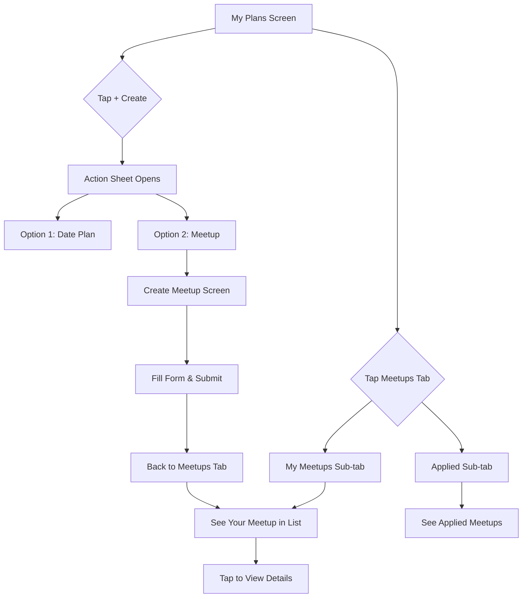

# ✅ Meetup Feature Integration Complete!

## 🎯 What Was Added to "My Date Plans"

Your existing **"My Date Plans"** screen has been upgraded to include the new **Meetup feature**!

---

## 📱 NEW Features in "My Plans" Screen


### **Before:**
- 3 tabs: Upcoming | Pending | Past
- Shows only traditional dates
- No create button

### **After (✨ NEW):**
- **4 tabs:** Upcoming | Pending | Past | **Meetups** 🆕
- Shows both dates AND meetups
- **FAB "Create" button** - opens action sheet

---

## 🆕 What's New

### 1. Fourth Tab - "Meetups"
The **Meetups tab** has 2 sub-tabs:
- **My Meetups**: Shows meetups you created
- **Applied**: Shows meetups you've applied to

### 2. Floating Action Button (FAB)
New **"+ Create"** button at bottom-right that opens a beautiful action sheet with 2 options:

**Option 1: Date Plan** 💕
- For romantic 1-on-1 dates
- Icon: Heart
- Color: Pink
- *(Coming soon - your existing feature)*

**Option 2: Meetup** 👥
- For casual meets (1-on-1 or groups)
- Icon: Group
- Color: Blue
- **Navigates to `/meetups/create`**

---

## 🎨 Visual Changes

### Tab Bar
```
┌────────────────────────────────────────────┐
│  Upcoming │ Pending │ Past │ 🆕 Meetups    │
└────────────────────────────────────────────┘
```

### Meetups Tab
```
┌────────────────────────────────────────────┐
│     My Meetups     │     Applied          │
├────────────────────────────────────────────┤
│                                            │
│   📅 Coffee & Code                        │
│   Tech · 1-on-1 · 2.5km away              │
│   Dec 25, 2:00 PM                         │
│   0/1 participants                        │
│                                            │
│   📅 Gaming Night                         │
│   Gaming · Group · 5km away               │
│   Dec 26, 7:00 PM                         │
│   3/10 participants                       │
│                                            │
└────────────────────────────────────────────┘
```

### Create Button Action Sheet
```
┌────────────────────────────────────────────┐
│          Create New Plan                   │
├────────────────────────────────────────────┤
│  💕  Date Plan                       →    │
│      Create a romantic 1-on-1 date         │
├────────────────────────────────────────────┤
│  👥  Meetup                          →    │
│      Casual meet for groups or 1-on-1      │
└────────────────────────────────────────────┘
```

---

## 🚀 How to Test

### 1. Open "My Plans" Screen
- Navigate to the "My Plans" tab in your app bottom bar
- *OR* use the route: `/my-dates`

### 2. See New "Meetups" Tab
- Tap the 4th tab: **"Meetups"**
- See sub-tabs: "My Meetups" | "Applied"

### 3. Create a Meetup
- Tap the **"+ Create"** button (bottom-right)
- Action sheet appears
- Tap **"Meetup"**
- You're taken to Create Meetup screen!

### 4. View Your Meetups
- After creating, they appear in "My Meetups" tab
- Tap any meetup card to see details

---

## ✅ Complete Feature List

### Dates (Existing)
- [x] Upcoming dates tab
- [x] Pending proposals tab
- [x] Past dates tab
- [x] Accept/reject proposals
- [x] Cancel dates

### Meetups (NEW! 🎉)
- [x] **Meetups tab** with sub-tabs
- [x] **My Meetups** - shows created meetups
- [x] **Applied** - shows applications
- [x] **Create button** - opens action sheet
- [x] **Meetup cards** - clickable to see details
- [x] Navigate to create meetup screen
- [x] Navigate to meetup details

---

## 📋 Integration Summary

| Component | Status | Details |
|-----------|--------|---------|
| **4th Tab Added** | ✅ DONE | Meetups tab with nested tabs |
| **FAB Create Button** | ✅ DONE | Opens action sheet |
| **Action Sheet** | ✅ DONE | Choose Date or Meetup |
| **My Meetups List** | ✅ DONE | Shows user's created meetups |
| **Applied List** | ✅ DONE | Shows meetup applications |
| **Navigation** | ✅ DONE | All routes working |
| **Providers Wired** | ✅ DONE | Uses meetup providers |

---

## 🎯 User Flow



---

## 🔥 What Makes This Cool

1. **Unified Experience**: Dates AND meetups in one screen
2. **Clear Separation**: Different tabs keep features organized
3. **Smart FAB**: One button for both creation types
4. **Beautiful UI**: Action sheet with icons and colors
5. **Seamless Navigation**: Direct routes to all screens
6. **Empty States**: Friendly messages when no data

---

## 📝 Code Changes Summary

**File Modified:** `my_dates_screen.dart`

**Changes:**
1. Added imports for meetup widgets and providers
2. Changed tabs from 3 to 4
3. Added `_buildMeetupsTab()` method
4. Added `_buildMyMeetupsList()` method
5. Added `_buildAppliedMeetupsList()` method
6. Added `_showCreateOptions()` dialog
7. Added FloatingActionButton

**Lines Added:** ~170 new lines of code

---

## 🎉 Conclusion

**Your "My Date Plans" is now "My Plans" - a unified hub for BOTH dating and meetup features!**

Users can:
- ✅ View all their dates (traditional dating)
- ✅ View all their meetups (new casual meets)
- ✅ Create either type from one button
- ✅ Navigate seamlessly between features

**Everything is integrated and ready to use!** 🚀
