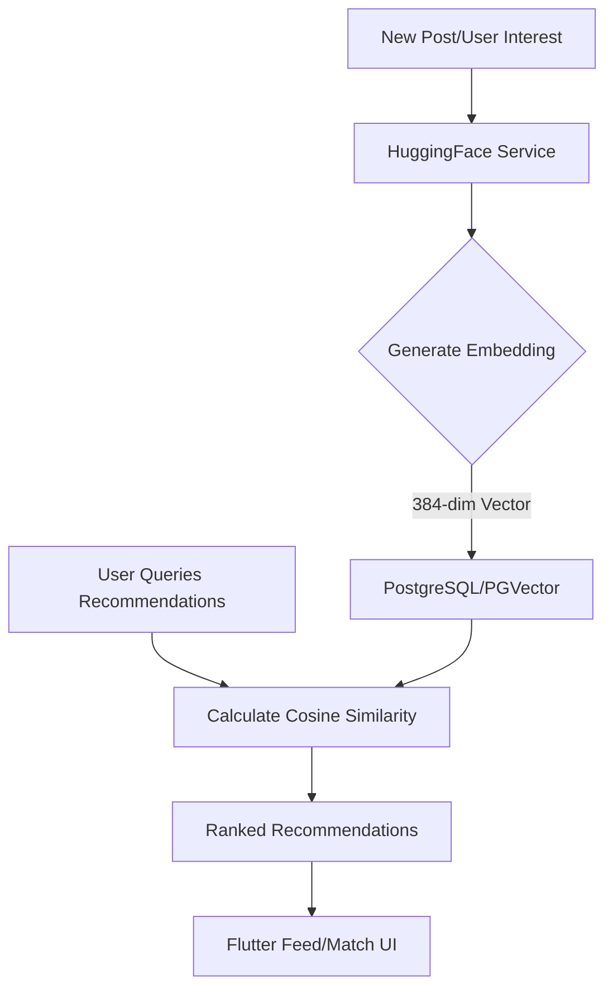
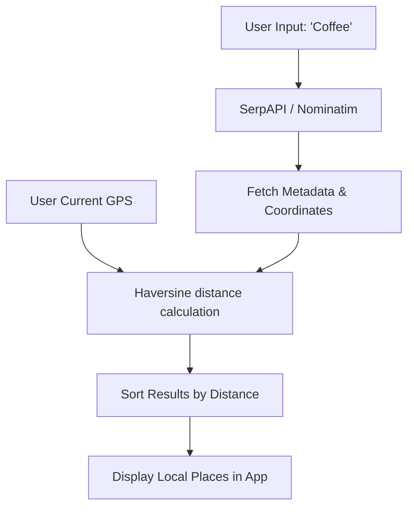
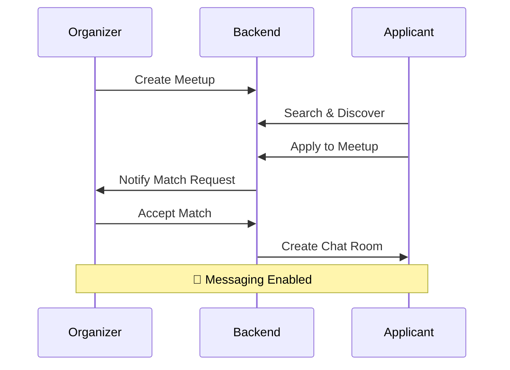

# 💕 FYN - Dating & Social Connection App

A full-stack dating and social connection application with **Spring Boot** backend and **Flutter** mobile/web frontend. Featuring AI-powered recommendations and intelligent location services.

    

---

## 📋 Table of Contents

- [Features](#-features)
- [Tech Stack](#-tech-stack)
- [Project Structure & File Guide](#-project-structure--file-guide)
- [AI & Intelligence](#-ai--intelligence)
- [Quick Start](#-quick-start)
- [API Documentation](#-api-documentation)
- [Database Schema](#-database-schema)
- [Workflow Diagrams](#-workflow-diagrams)

---

## ✨ Features

| Feature | Description |
|---------|-------------|
| 🔐 **Authentication** | JWT-based login/register with refresh tokens |
| 🎯 **Meetups** | Create and discover meetups, apply/accept matching |
| 💬 **Messaging** | Real-time chat via WebSocket |
| 🧠 **AI Recommendation** | Neural-powered match suggestions using Hugging Face |
| 📍 **Smart Location** | Optimized search using Nominatim & distance sorting |
| 📹 **Video Call** | 1-on-1 video calls (WebRTC) |
| 📝 **Posts & Stories** | Social feed and 24-hour ephemeral content |

---

## 🛠 Tech Stack

### Backend
- **Java 17** + **Spring Boot 3**
- **PostgreSQL** (with **PostGIS** & **PGVector** for spatial & AI data)
- **MinIO** (S3 Object Storage) & **Redis** (Caching)
- **Hugging Face Inference API** (Text Embeddings)
- **Nominatim / SerpAPI** (Location Intelligence)

### Frontend
- **Flutter 3** (Dart)
- **Riverpod** (State Management)
- **GoRouter** & **Dio**
- **Firebase** (Notifications)

---

## 🏗 Project Structure & File Guide

### Backend Infrastructure (`fyn-monolithic/src/main/resources`)

| File/Folder | Purpose |
|-------------|---------|
| `db/migration/` | **Flyway Migrations**: Scripts (`V1__...`) that automatically build/update your DB schema. Essential for cross-environment setup. |
| `application.yml` | **Main Config**: Core application settings (Ports, General DB connection). |
| `application-dev.yml` | **Dev Config**: Local development settings (Local Postgres, debug logging). |
| `application-ai.yml` | **AI Config**: Keys and model settings for Hugging Face and location APIs. |
| `seed_data_safe.sql` | **Core Data**: Mandatory initial data (Genders, Interest categories). |
| `sample_data_*.sql` | **Demo Data**: Mock users and posts for testing the UI without manual entry. |

---

## 🧠 AI & Intelligence

### 🤖 Hugging Face Integration
The system uses the `sentence-transformers/all-MiniLM-L6-v2` model via Hugging Face Inference API to generate 384-dimensional vector embeddings of user interests and post content.

**Activity: Content Recommendation Flow**


### 📍 Intelligent Location (SerpAPI / Nominatim)
Instead of simple text matching, the `SerpApiService` handles spatial-aware searches using real-world coordinates and distance-based sorting.

**Activity: Location Search Flow**


---

## 🚀 Quick Start

### 1️⃣ Start Backend
```powershell
cd fyn-monolithic
docker-compose up -d  # Starts Postgres, Redis, MinIO
.\mvnw spring-boot:run
```

### 2️⃣ Start Frontend
```powershell
cd fyn-flutter-app
flutter pub get
flutter run -d chrome
```

---

## 🔄 Workflow Diagrams

### Meetup Matching Flow


---

## 📡 API Documentation (Highlights)

| Service | Endpoint | Highlight |
|---------|----------|-----------|
| **AI** | `/api/posts/recommended` | AI-powered feeds |
| **Location** | `/api/v1/meetups/discover` | Proximity-based search |
| **Auth** | `/api/auth/login` | Secure JWT Session |

---

Made with ❤️ by FYN Team
