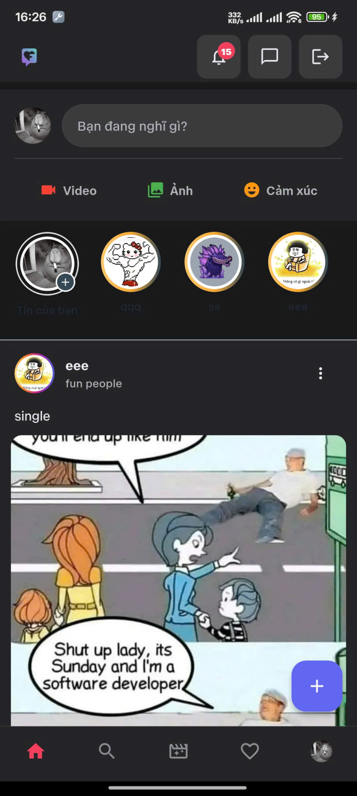
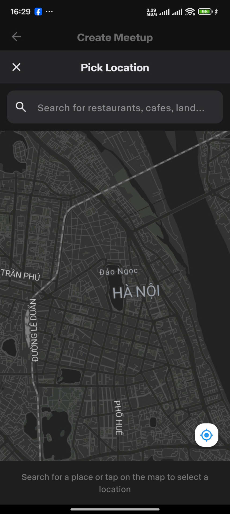
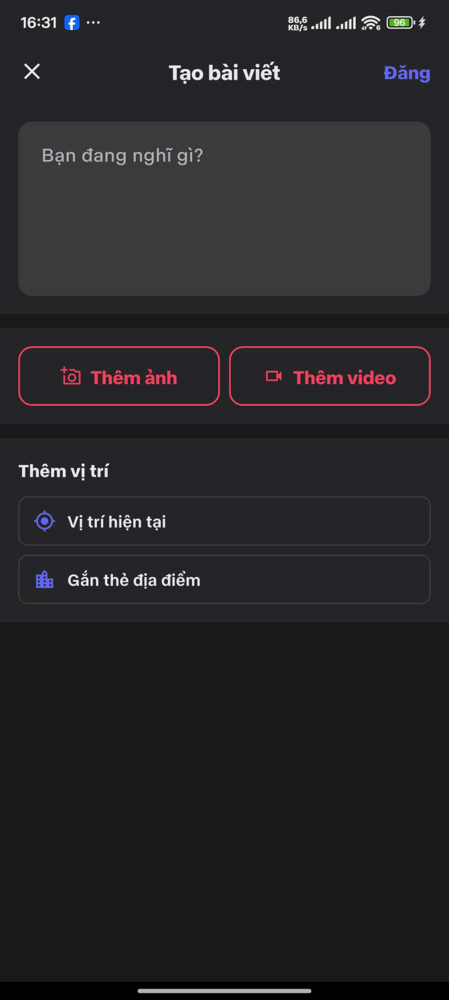
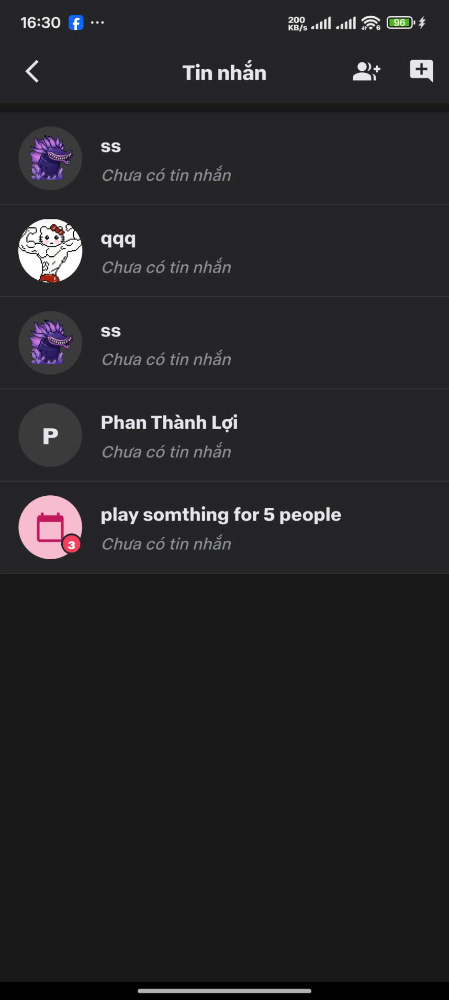
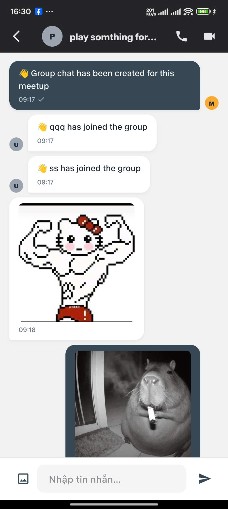
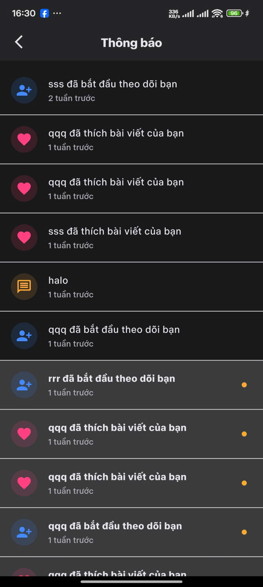
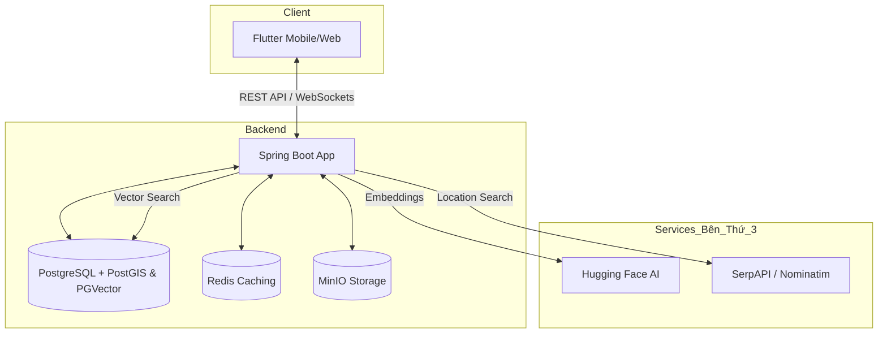
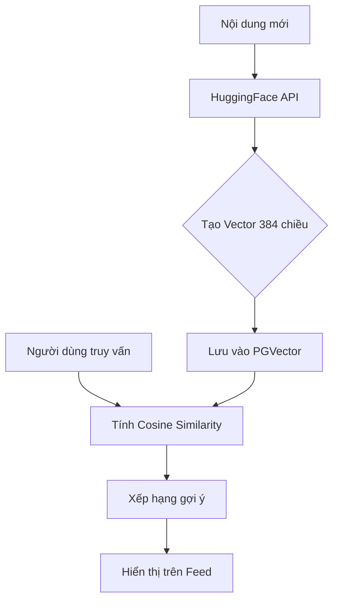

# 💖 FYN - Nền Tảng Hẹn Hò & Kết Nối Xã Hội Toàn Diện

Dự án **FYN** là một ứng dụng mạng xã hội và hẹn hò hiện đại, được xây dựng với kiến trúc **Monolithic Backend (Java Spring Boot)** và **Multi-platform Frontend (Flutter)**. Ứng dụng tích hợp trí tuệ nhân tạo (AI) để gợi ý nội dung và hệ thống định vị thông minh để kết nối người dùng một cách tối ưu nhất.

     

---

## 📱 Hình Ảnh Ứng Dụng (Screenshots)

<p align="center">
  
  
  
  
  
  
</p>

---

## ✨ Tính Năng Cốt Lõi

### 📱 Frontend (Flutter App)
- **News Feed**: Luồng tin cập nhật thời gian thực, hỗ trợ hiển thị đa phương tiện (Ảnh, Video).
- **Stories**: Khoảnh khắc biến mất sau 24h, hỗ trợ tương tác nhanh.
- **Meetup System**: Tìm kiếm và tham gia các buổi gặp gỡ quanh vị trí hiện tại dựa trên GPS.
- **Real-time Chat**: Nhắn tin tức thời qua WebSocket với hỗ trợ gửi ảnh và emoji.
- **AI Recommendation**: Gợi ý bạn bè và bài viết phù hợp với sở thích cá nhân.
- **Admin Dashboard**: Giao diện quản lý báo cáo và nội dung vi phạm dành cho Admin.

### ⚙️ Backend (Spring Boot Service)
- **Hệ Thống Auth**: Xác thực dựa trên JWT với cơ chế Refresh Token bảo mật.
- **AI Engine**: Tích hợp Hugging Face API để chuyển đổi nội dung thành Vector Embedding (384-dim).
- **Spatial Search**: Sử dụng PostGIS để tính toán khoảng cách và tìm kiếm địa điểm xung quanh.
- **Cloud Storage**: Quản lý tập trung tài nguyên hình ảnh/video qua MinIO (S3 Compatible).
- **Moderation**: Hệ thống quản lý báo cáo (Report) bài viết và xử lý vi phạm linh hoạt.

---

## 🛠️ Công Nghệ Sử Dụng

### Backend
- **Ngôn ngữ**: Java 21
- **Framework**: Spring Boot 3.4.1
- **Cơ sở dữ liệu**: PostgreSQL 15 (với **PostGIS** & **PGVector**)
- **Caching**: Redis
- **Lưu trữ**: MinIO
- **Migration**: Flyway

### Frontend
- **Framework**: Flutter 3 (Hỗ trợ Web, Android, iOS)
- **Quản lý trạng thái**: Riverpod
- **Điều hướng**: GoRouter
- **Kết nối API**: Dio + Interceptors

---

## 🏗️ Kiến Trúc Hệ Thống



---

## 🚀 Hướng Dẫn Cài Đặt (Quick Start)

### 1️⃣ Yêu cầu hệ thống
- Docker Desktop
- Java 21 SDK
- Flutter SDK

### 2️⃣ Khởi chạy hạ tầng (Docker)
```powershell
cd fyn-monolithic
docker-compose up -d
```
*Lệnh này sẽ khởi chạy Postgres, Redis, và MinIO.*

### 3️⃣ Chạy Backend
```powershell
./mvnw spring-boot:run
```
*Lưu ý: Flyway sẽ tự động khởi tạo cấu trúc Database (Schema) trong lần chạy đầu tiên.*

### 4️⃣ Chạy Frontend
```powershell
cd fyn-flutter-app
flutter pub get
flutter run
```

---

## 🧠 Trí Tuệ Nhân Tạo & Định Vị

### 🤖 Logic Gợi Ý Của AI
Hệ thống sử dụng model `all-MiniLM-L6-v2` để tạo vector cho nội dung và sở thích.


---

## 🔒 Tài Khoản Demo
- **Admin**: `admin@fyn.vn` / `password`
- **User**: `luan@gmail.com` / `password`

---

## 📡 API Documentation (Nổi bật)
- **Auth**: `/api/auth/login` - Đăng nhập bảo mật JWT.
- **Feed**: `/api/posts/recommended` - Lấy bài viết dựa trên AI.
- **Meetup**: `/api/v1/meetups/discover` - Tìm kiếm buổi hẹn gần đây.

---
Made with ❤️ by FYN Team
