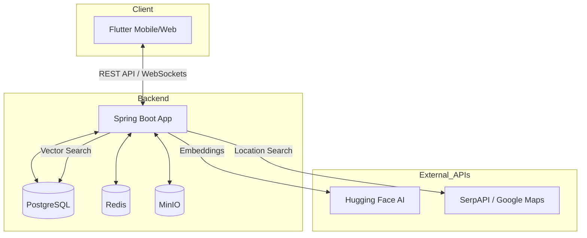

# 🌟 FYN Social - Toàn Diện & Chuyên Sâu

Dự án **FYN Social** là một nền tảng mạng xã hội và hẹn hò (Dating) hiện đại, được xây dựng với kiến trúc **Monolithic Backend (Java Spring Boot)** và **Multi-platform Frontend (Flutter)**. Ứng dụng tích hợp trí tuệ nhân tạo (AI) để gợi ý nội dung và hệ thống định vị thông minh để kết nối người dùng.

---

## 🚀 Tính Năng Cốt Lõi

### 1. 📱 Mạng Xã Hội (Social Feed)
- **News Feed**: Luồng tin cập nhật thời gian thực, hỗ trợ hiển thị đa phương tiện (Ảnh, Video).
- **Đa Phương Tiện**: Tải lên nhiều ảnh/video trong một bài viết với trình duyệt carousel mượt mà.
- **Hashtags**: Tự động nhận diện và phân loại bài viết theo hashtag, tăng khả năng tìm kiếm.
- **Tương Tác**: Thả tim (Like), Bình luận (Comment) chuyên sâu, Bookmark bài viết yêu thích.
- **Stories**: Khoảnh khắc biến mất sau 24h, hỗ trợ ảnh và video.

### 2. ❤️ Hệ Thống Hẹn Hò & Gặp Gỡ (Meetup System)
- **Khám Phá (Discover)**: Tìm kiếm các buổi gặp gỡ quanh vị trí hiện tại dựa trên GPS và Place Tag.
- **Tạo Meetup**: Người dùng có thể tổ chức các buổi hẹn hò, chọn địa điểm thực tế từ bản đồ (SerpAPI/Google Maps).
- **Ghép Đôi (Matching)**: Hệ thống "Apply" vào Meetup. Chủ buổi hẹn có quyền Duyệt (Approve) hoặc Từ chối (Reject) người tham gia.
- **Chat Riêng**: Chỉ khi được chủ buổi hẹn duyệt, phòng chat riêng giữa 2 người mới được kích hoạt.

### 3. 🛡️ Quản Trị & Điều Phối (Admin & Moderation)
- **Dashboard Admin**: Giao diện dành riêng cho tài khoản `ADMIN` để quản lý báo cáo.
- **Báo Cáo Nội Dung (Reporting)**: Người dùng có thể báo cáo bài viết vi phạm (Spam, nội dung không phù hợp...).
- **Xử Lý Vi Phạm**: Admin xem chi tiết nội dung bị báo cáo, người báo cáo và đưa ra quyết định (Xóa bài, bỏ qua báo cáo).
- **Phân Quyền (RBAC)**: Hệ thống tự động chuyển hướng người dùng dựa trên Role (USER/ADMIN) ngay sau khi đăng nhập.

### 4. 🧠 Trí Tuệ Nhân Tạo (AI Recommendation)
- **Personalized Feed**: Sử dụng model AI `MiniLM-L6` từ Hugging Face để tạo Vector Embeddings cho sở thích của người dùng và nội dung bài viết.
- **PGVector**: Lưu trữ vector 384 chiều trực tiếp trong PostgreSQL.
- **Cosine Similarity**: Tính toán độ tương đồng giữa người dùng và bài viết để hiển thị các nội dung phù hợp nhất lên đầu bảng tin.

---

## 🛠️ Công Nghệ Sử Dụng

### Backend (fyn-monolithic)
- **Framework**: Spring Boot 3.4.1 (Java 21)
- **Database**: PostgreSQL 15 + **PostGIS** (Địa lý) + **PGVector** (AI)
- **Caching**: Redis
- **Storage**: MinIO (Tương thích S3 - Lưu trữ tập trung ảnh/video)
- **Migration**: Flyway (Quản lý schema tự động)
- **Security**: Spring Security + JWT (Stateless Authentication)

### Frontend (fyn-flutter-app)
- **Framework**: Flutter 3 (Support Web, Android, iOS)
- **State Management**: Riverpod (Reactive state)
- **Navigation**: GoRouter (Deep linking & Redirect logic)
- **Network**: Dio + Interceptors (Xử lý token và lỗi tập trung)

---

## 🏗️ Kiến Trúc Hệ Thống



---

## 🏁 Hướng Dẫn Cài Đặt (Quick Start)

### 1. Chuẩn Bị Môi Trường
Yêu cầu: Docker Desktop, Java 21, Flutter SDK.

### 2. Khởi Chạy Hạ Tầng (Infrastructure)
```powershell
cd fyn-monolithic
docker-compose up -d
```
*Lưu ý: Hệ thống sẽ khởi chạy Postgres, Redis, MinIO tự động.*

### 3. Chạy Backend
```powershell
./mvnw clean package -DskipTests
./mvnw spring-boot:run
```
*Schema database sẽ tự động được Flyway khởi tạo.*

### 4. Chạy Frontend
```powershell
cd fyn-flutter-app
flutter pub get
flutter run
```

---

## 🔒 Tài Khoản Demo
- **Admin**: `admin@fyn.vn` / `password`
- **User**: `luan@gmail.com` / `password`

---

## 📡 API Endpoints Quan Trọng
- **Auth**: `/api/auth/login`, `/api/auth/register`
- **Feed**: `/api/posts/feed`, `/api/posts/recommended`
- **Moderation**: `/api/admin/reported-posts`
- **Meetup**: `/api/v1/meetups`, `/api/v1/meetups/discover`

---
*Phát triển bởi Đội ngũ FYN với sự hỗ trợ của Antigravity AI.*
