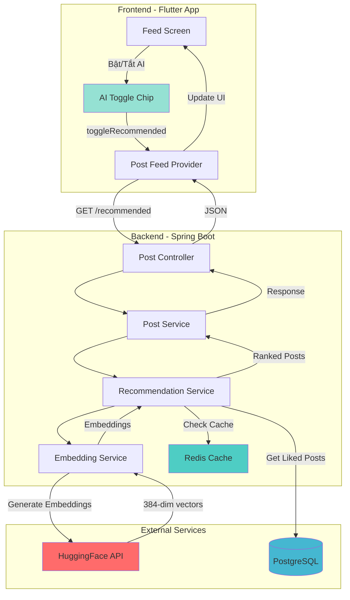
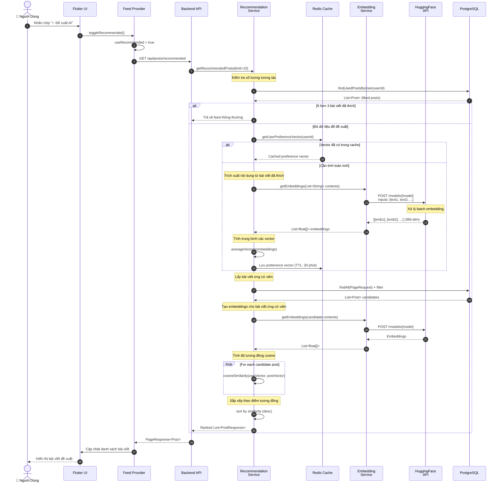
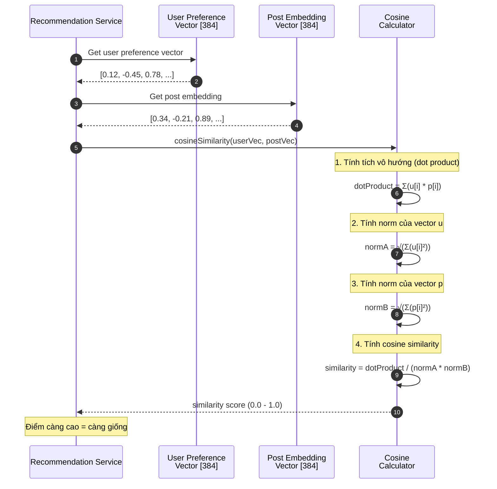
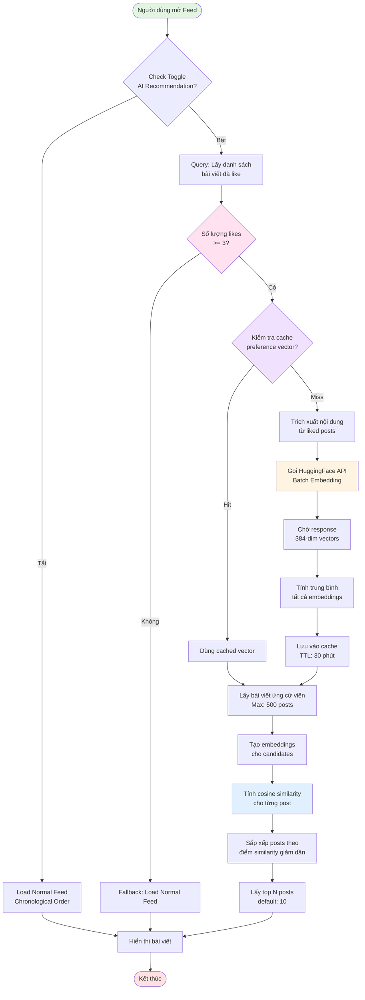

# 🚀 FYN Social Network - Monolithic Backend

Full-featured social network backend built with Spring Boot 3, Java 21, PostgreSQL, and MinIO.

## 📋 Features

### User Management
- ✅ User registration & authentication (JWT)
- ✅ User profiles with avatar & cover photo
- ✅ Follow/Unfollow system
- ✅ User settings & preferences

### Posts & Feed
- ✅ Create posts with text & media (images/videos)
- ✅ Timeline feed from followed users
- ✅ Like/Unlike posts
- ✅ Comment on posts (with nested replies)
- ✅ Hashtag support

### Messaging
- ✅ Direct messages (1-on-1)
- ✅ Group conversations
- ✅ Send text & media messages
- ✅ Real-time message history

### Notifications
- ✅ Like notifications
- ✅ Comment notifications
- ✅ Follow notifications
- ✅ Message notifications

### Search
- ✅ Search users
- ✅ Search posts
- ✅ Search hashtags
- ✅ Trending hashtags

## 🛠️ Tech Stack

- **Java 21** - Latest LTS version
- **Spring Boot 3.2** - Framework
- **Spring Security + JWT** - Authentication
- **PostgreSQL** - Database
- **MinIO** - Object storage for media files
- **Spring Data JPA** - ORM
- **MapStruct** - DTO mapping
- **Lombok** - Reduce boilerplate
- **Maven** - Build tool

## 📦 Installation & Setup

### Prerequisites

- Java 21 (JDK)
- Maven 3.8+
- Docker & Docker Compose

### Step 1: Clone Repository

```bash
git clone <repository-url>
cd fyn-monolithic
```

### Step 2: Start Docker Services

Start PostgreSQL and MinIO:

```bash
docker-compose up -d
```

This will start:
- **PostgreSQL** on port `5432`
- **MinIO** on port `9000` (API) and `9001` (Console)

### Shared Docker Data

- PostgreSQL data files are stored in `docker-data/postgres`
- MinIO objects are stored in `docker-data/minio`

Keep these folders under version control (or share them out-of-band) so teammates can pull identical seed data. Refreshing local datasets is as simple as replacing the contents of these folders before running `docker-compose up`.

### Step 3: Create Database Schema

Connect to PostgreSQL and run the schema:

```bash
docker exec -i fyn-postgres psql -U postgres -d fyn-monolithic < database-schema.sql
```

Or manually:

```bash
psql -h localhost -U postgres -d fyn-monolithic -f database-schema.sql
```

### Step 4: Configure Application

Update `src/main/resources/application.yml` if needed (default values work with Docker setup).

### Step 5: Build & Run

```bash
mvn clean install
mvn spring-boot:run
```

Or run directly:

```bash
java -jar target/fyn-monolithic-1.0.0.jar
```

The application will start on `http://localhost:8080`

## 🔑 Generate JWT Secret

For production, generate a secure JWT secret:

```bash
openssl rand -base64 64
```

Update in `application.yml`:

```yaml
jwt:
  secret: <your-generated-secret>
```

## 🧪 Testing the API

### 1. Register a User

```bash
curl -X POST http://localhost:8080/api/v1/auth/register \
  -H "Content-Type: application/json" \
  -d '{
    "email": "user@example.com",
    "username": "testuser",
    "password": "password123"
  }'
```

### 2. Login

```bash
curl -X POST http://localhost:8080/api/v1/auth/login \
  -H "Content-Type: application/json" \
  -d '{
    "username": "testuser",
    "password": "password123"
  }'
```

Save the `accessToken` from response.

### 3. Get User Profile

```bash
curl -X GET http://localhost:8080/api/v1/users/me \
  -H "Authorization: Bearer <your-access-token>"
```

### 4. Create a Post

```bash
curl -X POST http://localhost:8080/api/v1/posts \
  -H "Authorization: Bearer <your-access-token>" \
  -F 'post={"content":"Hello World! #firstpost","privacy":"public"};type=application/json' \
  -F 'files=@/path/to/image.jpg'
```

## 📚 API Documentation

### REST API Surface

**Auth**
- `POST /api/auth/register`
- `POST /api/auth/login`
- `POST /api/auth/refresh`
- `POST /api/auth/password/change`
- `POST /api/auth/password/forgot`
- `POST /api/auth/password/verify-otp`

**Users**
- `GET /api/users/me`
- `GET /api/users/{id}`
- `GET /api/users/username/{username}`
- `PUT /api/users/profile`
- `POST /api/users/profile/avatar`
- `POST /api/users/{id}/follow`
- `DELETE /api/users/{id}/follow`
- `GET /api/users/{id}/followers`
- `GET /api/users/{id}/following`

**Posts**
- `POST /api/posts`
- `GET /api/posts/feed`
- `GET /api/posts/user/{id}`
- `DELETE /api/posts/{id}`
- `POST /api/posts/{postId}/comments`
- `GET /api/posts/{postId}/comments`
- `DELETE /api/posts/{postId}/comments/{commentId}`
- `POST /api/posts/{postId}/likes`
- `DELETE /api/posts/{postId}/likes`

**Messaging**
- `POST /api/conversations`
- `GET /api/conversations`
- `POST /api/conversations/{conversationId}/messages`
- `GET /api/conversations/{conversationId}/messages`

**Notifications**
- `GET /api/notifications`
- `POST /api/notifications/{notificationId}/read`

**Search**
- `GET /api/search/hashtags?tag={value}`

See the controllers under `src/main/java/com/fyn_monolithic/controller` for request/response DTOs.

## 🗂️ Project Structure

```
src/main/java/com/fyn/monolithic/
├── config/          # Configuration classes
├── controller/      # REST controllers
├── service/         # Business logic
├── repository/      # Data access layer
├── model/           # JPA entities
├── dto/             # Data transfer objects
├── mapper/          # MapStruct mappers
├── security/        # Security & JWT
├── exception/       # Exception handling
└── util/            # Utility classes
```

## 🐳 Docker Services

### PostgreSQL

- **Host:** localhost:5432
- **Database:** fyn-monolithic
- **User:** postgres
- **Password:** postgres

### MinIO

- **API:** http://localhost:9000
- **Console:** http://localhost:9001
- **Access Key:** minioadmin
- **Secret Key:** minioadmin
- **Bucket:** fyn-data

Access MinIO Console at http://localhost:9001 with credentials above.

## ☁️ MinIO Integration

- `MinioConfig` wires the `MinioClient` using properties in `application.yml`
- `MinioService` supports upload/download/presigned URLs and media-type detection
- `FileStorageService` persists file metadata to the `file_storage` table
- Storage-aware services (`PostService`, `ProfileService`, `MessageService`) delegate all object handling to `MinioService`

## 🔧 Environment Variables

Create `.env` file for production:

```env
# Database
DB_HOST=localhost
DB_PORT=5432
DB_NAME=fyn-monolithic
DB_USER=postgres
DB_PASSWORD=<secure-password>

# JWT
JWT_SECRET=<your-secure-secret>
JWT_EXPIRATION=86400000
JWT_REFRESH_EXPIRATION=604800000

# MinIO
MINIO_ENDPOINT=http://localhost:9000
MINIO_ACCESS_KEY=minioadmin
MINIO_SECRET_KEY=minioadmin
MINIO_BUCKET=fyn-data
```

## 📈 Database Schema

The project includes complete schema with:

- **14 tables** with proper relationships
- **UUID primary keys** for all entities
- **Audit fields** (created_at, updated_at, deleted_at)
- **Indexes** for performance optimization
- **Foreign keys** with cascade rules
- **Triggers** for automatic timestamp updates

## 🚀 Production Deployment

### 1. Build Production JAR

```bash
mvn clean package -DskipTests
```

### 2. Run with Production Profile

```bash
java -jar target/fyn-monolithic-1.0.0.jar --spring.profiles.active=prod
```

### 3. Use External Database

Update `application-prod.yml` with your production database credentials.

MIT License

## 🤝 Contributing

Contributions are welcome! Please open an issue or submit a pull request.

---

## 🤖 AI Embedding & Post Recommendation System

### Tổng Quan (Overview)

Hệ thống đề xuất bài viết thông minh sử dụng **HuggingFace Sentence Transformers** để phân tích nội dung bài viết và đề xuất các bài viết phù hợp dựa trên sở thích của người dùng.

**Mô hình AI:** `sentence-transformers/all-MiniLM-L6-v2` (384 chiều embedding)

### Kiến Trúc Hệ Thống (System Architecture)



### Biểu Đồ Tuần Tự (Sequence Diagram)

#### 1. Quy Trình Đề Xuất Bài Viết (Post Recommendation Flow)



#### 2. Quy Trình Tính Toán Độ Tương Đồng (Similarity Calculation)



### Biểu Đồ Hoạt Động (Activity Diagram)



### Công Thức Toán Học (Mathematical Formulas)

#### 1. Cosine Similarity

Độ tương đồng cosine giữa 2 vector **u** và **v**:

```
similarity(u, v) = (u · v) / (||u|| × ||v||)

Trong đó:
- u · v = Σ(uᵢ × vᵢ)           (tích vô hướng)
- ||u|| = √(Σ(uᵢ²))            (độ dài vector u)
- ||v|| = √(Σ(vᵢ²))            (độ dài vector v)
- Kết quả: -1 ≤ similarity ≤ 1
  · 1  = hoàn toàn giống nhau
  · 0  = không liên quan
  · -1 = hoàn toàn đối lập
```

#### 2. User Preference Vector

Vector sở thích người dùng = trung bình các embedding của bài viết đã like:

```
preferenceVector = (1/N) × Σ embedding(likedPostᵢ)

N = số lượng bài viết đã like (tối đa 50 gần nhất)
```

### Cấu Hình (Configuration)

#### Backend Configuration (`application-ai.yml`)

```yaml
huggingface:
  api:
    token: ${HUGGINGFACE_API_TOKEN:}  # API token
  model: sentence-transformers/all-MiniLM-L6-v2

ai:
  recommendation:
    enabled: true
    min-interaction-count: 3        # Tối thiểu 3 likes
    max-candidate-posts: 500        # Tối đa 500 ứng cử viên
    cache-ttl-minutes: 30           # Cache 30 phút

spring:
  cache:
    type: simple
    cache-names:
      - userPreferenceVectors
```

#### Environment Variables

Tạo file `.env`:

```env
HUGGINGFACE_API_TOKEN=hf_your_token_here
```

### API Endpoints

| Endpoint | Method | Mô tả |
|----------|--------|-------|
| `/api/posts/recommended` | GET | Lấy bài viết đề xuất AI |
| `/api/posts/feed` | GET | Lấy feed thông thường |
| `/api/ai/health` | GET | Kiểm tra trạng thái HuggingFace API |
| `/api/ai/embed` | POST | Test embedding (debug only) |

### Ví Dụ Request/Response

#### Request: Get Recommended Posts

```bash
curl -X GET "http://localhost:8080/api/posts/recommended?page=0&size=10" \
  -H "Authorization: Bearer YOUR_JWT_TOKEN"
```

#### Response

```json
{
  "success": true,
  "data": {
    "content": [
      {
        "id": "uuid",
        "content": "AI-recommended post content...",
        "author": {...},
        "likeCount": 42,
        "commentCount": 15,
        "createdAt": "2025-12-19T12:00:00Z"
      }
    ],
    "page": 0,
    "size": 10,
    "totalElements": 50
  }
}
```

### Tối Ưu Hóa & Performance

1. **Caching Strategy**
   - User preference vectors được cache 30 phút
   - Giảm thiểu số lần gọi HuggingFace API
   - Cache invalidation khi user like bài viết mới

2. **Batch Processing**
   - Gửi nhiều texts trong 1 request đến HuggingFace
   - Giảm latency và tối ưu băng thông

3. **Fallback Mechanism**
   - Nếu < 3 likes → trả về feed thông thường
   - Nếu HuggingFace API lỗi → trả về feed thông thường
   - Đảm bảo UX luôn mượt mà

### Hạn Chế & Cải Tiến Tương Lai

**Hạn chế hiện tại:**
- Chỉ phân tích text content, chưa xử lý images/videos
- Cold start problem cho user mới
- Phụ thuộc vào HuggingFace API availability

**Cải tiến tương lai:**
- Pre-compute embeddings cho tất cả posts (background job)
- Sử dụng multimodal embeddings (CLIP) cho images
- Self-hosted embedding model để giảm dependency
- Collaborative filtering kết hợp content-based
- A/B testing để đánh giá hiệu quả

---

## 📧 Contact

For questions or support, contact: support@fyn.com